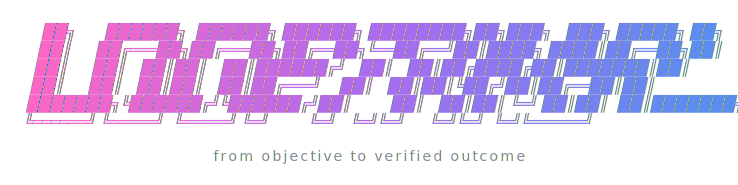

<p align="center">
  
</p>

# LoopPrint

LoopPrint is an interactive wizard that turns a vague goal into a complete, runnable **loop blueprint** —
a *print* you can execute, audit, and rerun. It's a single [Agent Skill](https://docs.claude.com/en/docs/claude-code/skills)
for Claude Code (and portable to any agent that reads a `SKILL.md`) that walks you from "I want to automate this"
to a spec, a state file, an external verifier, a run script, and a safety checklist — in a few minutes.

It exists because most "autonomous agent" failures aren't prompt problems. They're **missing-loop-component**
problems: no durable state, no objective gate, no stop condition, the maker grading its own work. LoopPrint
makes you supply all four before any tokens get spent on a run.

## The idea in one screen

Every reliable automation loop has four atoms. LoopPrint refuses to generate a blueprint until each is real:

| Atom | What it is | The failure it prevents |
|-|-|-|
| **Goal** | One objective, stated once | Scope drift, moving goalposts |
| **State** | A durable record of tried / failed / context | Re-doing work, amnesia across iterations |
| **Verifier** | A hard, **external** gate (test / build / lint / repro / rubric, or a separate reviewer) | "Looks good to me" — the maker grading itself |
| **Stop** | Success criteria **and** a safety limit (max iters / budget / halt) | Runaway loops, burning budget on a stuck task |

Plus one rule that ties them together: **maker ≠ checker** — nothing is "done" until something *other than the
thing that produced it* says so.

## Before the loop: the decision gate

The most valuable thing LoopPrint does is sometimes tell you **not** to build a loop. A loop only pays off when:

1. **It recurs** — the setup cost amortizes over many runs.
2. **An objective gate can reject bad output** — you can write the verifier.
3. **The budget absorbs retries** — iterating is cheaper than getting it right once by hand.
4. **The agent can run what it writes** — there's a real feedback signal, not a human in every cycle.

If any fail, the honest answer is a single high-quality pass, not a loop. The metric that matters is
**cost-per-accepted-change**, not tokens spent.

## Install

LoopPrint is a folder skill. Symlink (or copy) it where your agent looks for skills.

**Claude Code — as a plugin (recommended, one-time):**
```bash
/plugin marketplace add Renn-Labs/LoopPrint
/plugin install loopprint@renn-labs
```
Invoke it as `/loopprint:loopprint` (plugin skills are namespaced), or just say "design a loop for …".

**Claude Code — as a folder skill (clone + symlink, invokes as `/loopprint`):**
```bash
git clone https://github.com/Renn-Labs/LoopPrint ~/loopprint
ln -s ~/loopprint ~/.claude/skills/loopprint
```

**Other harnesses (OpenCode, OpenClaw, Hermes, Codex, Grok, …):** LoopPrint is one portable skill, and many agents
discover folder-skills the same way Claude does. Symlink it into that harness's skills directory:
```bash
ln -s ~/loopprint ~/.config/opencode/skills/loopprint  # OpenCode (also auto-loads from ~/.claude/skills)
ln -s ~/loopprint ~/.openclaw/skills/loopprint          # OpenClaw / EClaw
ln -s ~/loopprint ~/.hermes/skills/loopprint            # Hermes (then `hermes skills` to verify)
```
[OpenCode](https://opencode.ai/docs/skills/) natively discovers Agent Skills — including from `~/.claude/skills/` — so
if you did the Claude folder install above, LoopPrint already works in OpenCode with no extra step. For harnesses that
real-copy skills (Codex/OMX) or read an `AGENTS.md` catalog (Grok), register it the way that harness expects. The skill
is self-contained; `templates/` and `references/` load on demand.

## Use

```
/loopprint
```
LoopPrint runs a six-step wizard:

1. **Decision Gate** — runs the 4-condition test; gives an honest Pass/Fail with reasoning.
2. **Goal Refinement** — asks 3–5 sharp questions (frequency, verification method, irreversible risks, autonomy).
3. **Primitive Enforcement** — forces a concrete Goal, State artifact, Verifier, and Stop conditions.
4. **Pattern Selection** — recommends a pattern from the library and explains why.
5. **Artifact Generation** — writes the full package to `loops/<slug>/` (or `.omc/loops/<slug>/` on oh-my-claudecode).
6. **Final Review** — run now / refine / export / save as a reusable skill.

Say **"skip wizard"** (or "direct run") to bypass the interview and generate straight from a spec you already have.

## What it generates

A self-contained, runnable package per loop:

- `loop-spec.yaml` — the four atoms + pattern + budget guardrails, machine-readable
- `maker.sh` — the maker step, run as a **separate process** from the verifier (maker ≠ checker, structurally)
- `verify.sh` — the external verifier (exit-code gate)
- `state.md` — the durable State artifact (human view), updated every iteration
- `run-this-loop.sh` — an engine-agnostic runner; emits `metrics.jsonl` + `state.jsonl` (append-only) each iteration
- `safety-checklist.md` — human checkpoints + budget limits
- `flow.mmd` — a Mermaid diagram of the loop

Plus tooling: `loopprint-lint.py` gates the spec, `loopprint-report.py` computes **cost-per-accepted-change** from
`metrics.jsonl`, and `loopprint-skillify.py` promotes a GREEN loop into a reusable skill. Common verifier recipes
live in [`templates/verifier-library.yaml`](templates/verifier-library.yaml); preflight a loop with
`run-this-loop.sh --check`.

See [`templates/`](templates/) for the blanks and [`examples/`](examples/) for worked ones (ci-triage,
spec-driven-remediation, perf-optimization, hybrid).

## Pattern library

LoopPrint picks the loop's shape from four patterns (full detail in [`references/patterns.md`](references/patterns.md)):

| Pattern | For | Verifier shape |
|-|-|-|
| **MORTY** | Debugging a specific bug | Reproduction test goes green |
| **Spec-Driven Remediation** | Bringing a system up to a spec | Derived failing tests pass |
| **Performance Optimization** | Making something faster/cheaper | Benchmark hits the target, no regressions |
| **Hybrid** | Real work that mixes the above | Composite gate |

## Conform to your harness (optional)

By default LoopPrint is generic — it works anywhere with `loops/<slug>/` + a `verify.sh` gate. To make generated
blueprints use *your* system's conventions (state dir, reviewer agent, dispatch), drop a `profile.yaml` at
`./.loopprint/` or `~/.loopprint/`, or let the wizard detect your harness and suggest one. LoopPrint ships the
**contract, not a maintained per-harness matrix**, so it never goes stale when your tooling updates — the binding
values are owned by you/your harness. See [`references/profiles.md`](references/profiles.md). Example bindings for
oh-my-claudecode, OpenClaw, and Hermes live in [`profiles/`](profiles/).

## Troubleshooting

If the wizard won't trigger, a script errors, or an install looks partial, run the doctor:

```bash
python3 scripts/loopprint-doctor.py        # diagnose, with a copy-pasteable fix per problem
python3 scripts/loopprint-doctor.py --fix  # also apply safe repairs (chmod +x, relink a dangling symlink)
```

It walks the install bottom-up — files intact → scripts runnable → binding resolves → harness wired — and
prints an actionable fix for each problem. `--fix` only does safe, reversible repairs; anything riskier is
suggested, not done (maker ≠ checker). Full symptom→cause→fix map per install type in
[`references/troubleshooting.md`](references/troubleshooting.md).

## Design principles

- **The skill is the system.** LoopPrint encodes *components and gates*, not a personality. It does not demand a
  banner on every reply, a confirmation incantation, or that it "governs all activity." A loop works because its
  parts are real, not because the model recites a mantra.
- **Stack-agnostic core.** The methodology and artifacts stand alone. oh-my-claudecode is the one named
  integration example; heavier orchestration (isolated sub-agent dispatch, a separate plan/judge reviewer,
  cross-repo leasing) is described generically — wire in whatever you use.
- **Honest gates.** A verifier the maker can satisfy by self-assessment is not a verifier. LoopPrint always points
  the gate at something external.

## Security

Loop blueprints are executable code (`run-this-loop.sh`, `verify.sh`) parameterized by `loop-spec.yaml` — treat
them as code, not data ([SECURITY.md](SECURITY.md)). LoopPrint itself only reads/validates specs; the runner
executes `verify.sh` as a separate process and never `eval`s a command string from a spec.

## About

Built by **Erik Ford** at **[Renn Labs](https://github.com/Renn-Labs)** — an AI research & advisory firm.
LoopPrint distills one lesson from building autonomous agents: reliability comes from *loop components* — durable
state, external verification, stop conditions, and maker ≠ checker — not from clever prompts.

## License

MIT — see [LICENSE](LICENSE).
